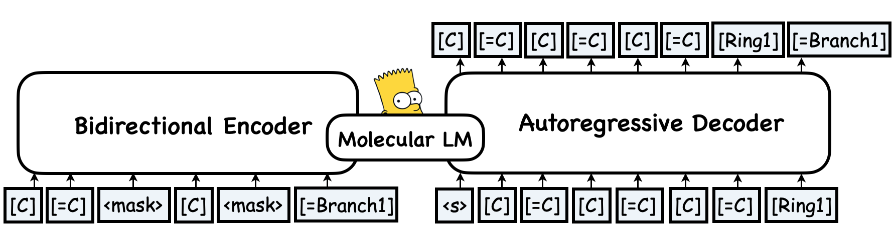

---
tags:
- molecular language model
- SELFIES
- molecule generation
widget:
- text: '[C][=C][C][=C][C][=C][Ring1][=Branch1]'
inference: false
---
# MolGen-large
MolGen-large was introduced in the paper ["Domain-Agnostic Molecular Generation with Self-feedback"](https://arxiv.org/pdf/2301.11259.pdf) and first released in [this repository](https://github.com/zjunlp/MolGen). It is a pre-trained molecular generative model built using the 100\% robust molecular language representation, SELFIES.

## Model description
MolGen-large is the first pre-trained model that only produces chemically valid molecules. 
With a training corpus of over 100 million molecules in SELFIES representation, MolGen-large learns the intrinsic structural patterns of molecules by mapping corrupted SELFIES to their original forms.
Specifically, MolGen-large employs a bidirectional Transformer as its encoder and an autoregressive Transformer as its decoder.
Through its carefully designed multi-task molecular prefix tuning (MPT), MolGen-large can generate molecules with desired properties, making it a valuable tool for molecular optimization.



## Intended uses
You can use the raw model for molecule generation or fine-tune it to a downstream task. Please take note that the following examples only demonstrate the utilization of our pre-trained model for molecule generation. See the [repository](https://github.com/zjunlp/MolGen) to look for fine-tune details on a task that interests you.

### How to use
Molecule generation example:
```python
>>> from transformers import AutoTokenizer, AutoModelForSeq2SeqLM

>>> tokenizer = AutoTokenizer.from_pretrained("zjunlp/HELM-Triple")
>>> model = AutoModelForSeq2SeqLM.from_pretrained("zjunlp/HELM-Triple")

>>> sf_input = tokenizer("[C][=C][C][=C][C][=C][Ring1][=Branch1]", return_tensors="pt")
>>> # beam search
>>> molecules = model.generate(input_ids=sf_input["input_ids"],
                              attention_mask=sf_input["attention_mask"],
                              max_length=15,
                              min_length=5,
                              num_return_sequences=5,
                              num_beams=5)
>>> sf_output = [tokenizer.decode(g, skip_special_tokens=True, clean_up_tokenization_spaces=True).replace(" ","") for g in molecules]
['[C][=C][C][=C][C][=C][Ring1][=Branch1]',
'[C][=C][C][=C][C][=C][C][=C][Ring1][=Branch1]',
'[C][=C][C][=C][C][=C][Ring1][=Branch1][C][=C][C][=C]',
'[C][=C][C][=C][C][=C][Ring1][=Branch1][C@H1][C][=C][C]',
'[C][=C][C][=C][C][=C][Ring1][=Branch1][C@H1][=C][C][=C]']
```


### BibTeX entry and citation info
```bibtex
@inproceedings{fang2023domain,
  author       = {Yin Fang and
                  Ningyu Zhang and
                  Zhuo Chen and
                  Xiaohui Fan and
                  Huajun Chen},
  title        = {Domain-Agnostic Molecular Generation with Chemical Feedback},
  booktitle    = {{ICLR}},
  publisher    = {OpenReview.net},
  year         = {2024},
  url          = {https://openreview.net/pdf?id=9rPyHyjfwP}
}
```