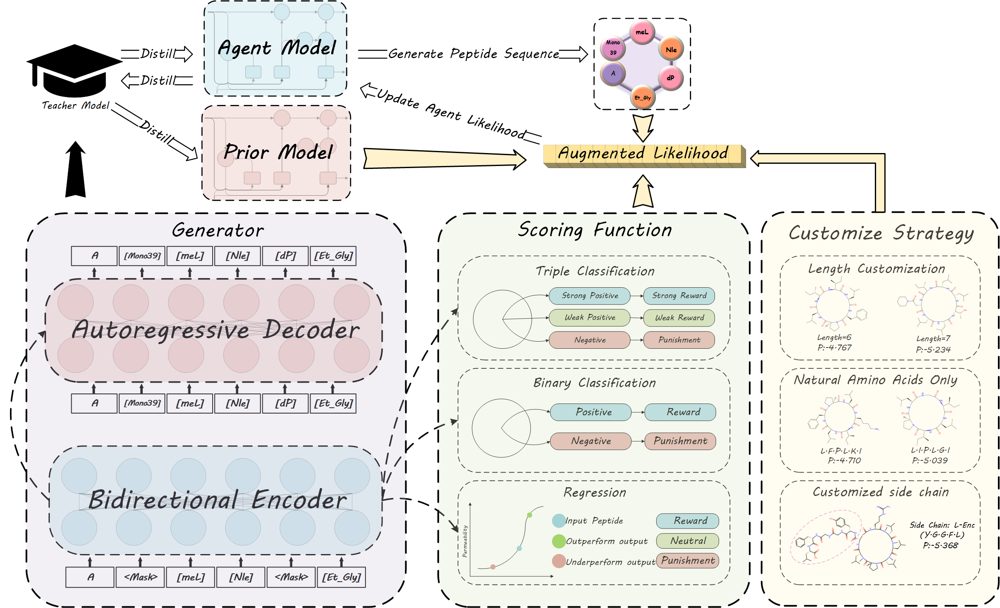
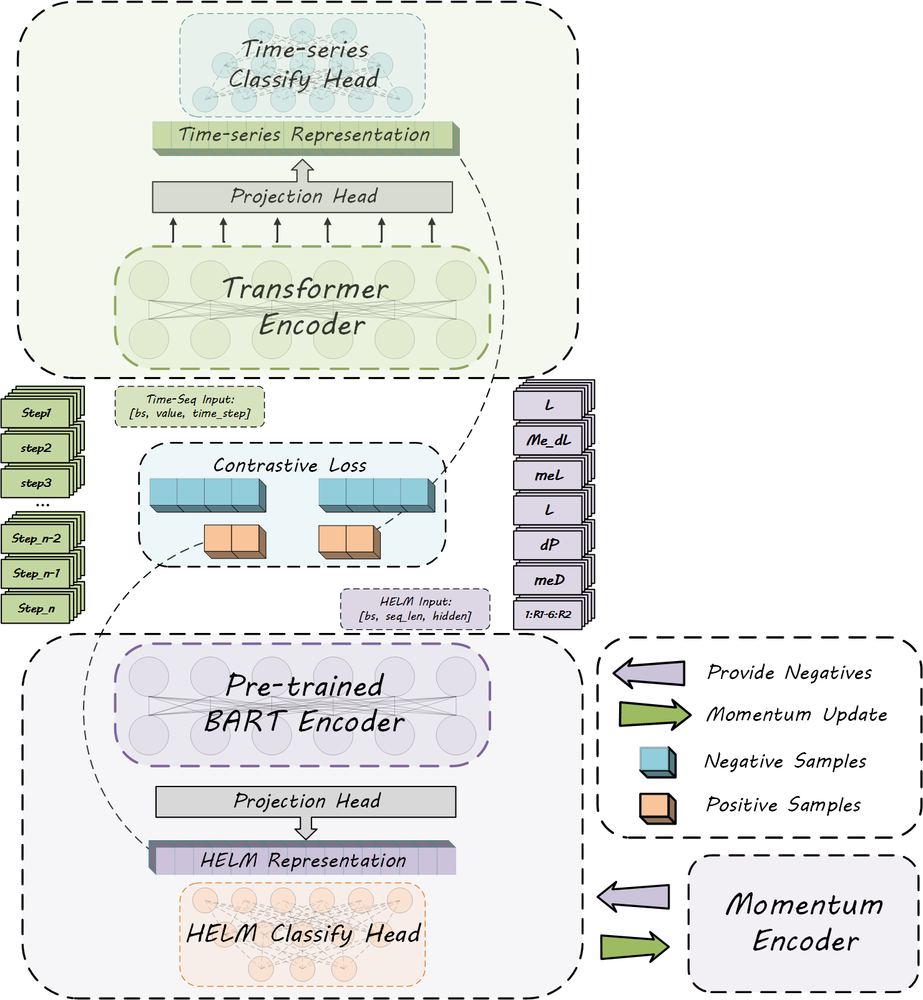

# AI-Driven De Novo design of customizable membrane permeable cyclic peptides

## Abstract
Cyclic peptides, with their excellent biological activity and stability, hold great promise in various fields. However, designing their membrane permeable ability is complex and resource intensive using traditional methods. To adress this, we presents an AI-driven de novo design framework, CCPep, which integrates reinforcement learning and contrastive learning to achieve efficient customized design of membrane permeable cyclic peptides. CCPep uses HELM to represent cyclic peptide sequences and leverages a pre-trained BART model for initial sequence generation. Membrane penetration ability is assessed via multiple scoring models , with reinforcement learning optimizing the generated sequences. Additionally, a time-series model is introduced to analyze molecular dynamics simulation data, further validating the dynamic membrane penetration characteristics of cyclic peptides. Results show that CCPep generated cyclic peptide sequences have a membrane penetration rate exceeding 98\% and can flexibly customize peptide chain length, natural amino acid proportion, and target segments. Moreover, alignment between the time series model and sequence encoder, achieved through contrastive learning, significantly boosts model performance. CCPep provides an efficient tool for cyclic peptide drug design and paves the way for AI driven molecular design with multi-objective optimization.





### Description of the document catalogue
eg:

```
filetree 
├── README.md
├── dataset
│  ├── amino_acid_vocab.json
│  ├── binding_vocab.json
├── extra model
│  ├── all_dataset.py
│  ├── contrastive_module.py
│  ├── contrastive_train.py
│  ├── helm_dataset.py
│  ├── helm_module.py
│  ├── time_dataset.py
│  ├── time_module.py
├── gmx_file
│  ├── conf.sh
│  ├── draw_gibbs_stage.sh
│  ├── gibbs.sh
│  ├── pca.sh
│  ├── pull.sh
│  ├── stage.sh
│  ├── SysEq.sh
├── gmx_utils
│  ├── gibbs_utils.py
│  ├── merge.py
│  ├── pca_utils.py
│  ├── xpm2png.py
├── HELM
│  ├── added_tokens.json
│  ├── config.json
│  ├── merges.txt
│  ├── special_tokens_map.json
│  ├── tokenizer_config.json
│  ├── voc.json
│  ├── vocab.json
├── main
│  ├── customize.py
│  ├── Dataset.py
│  ├── score_function.py
│  ├── Student_RNN.py
│  ├── Teacher_Bart.py
```

### Requirements
```
scikit-learn            1.3.0
pytorch                 2.2.1
pytorch-lightning       2.4.0
transformers            4.46.2
tokenizers              0.20.3
tqdm                    4.65.0
```

