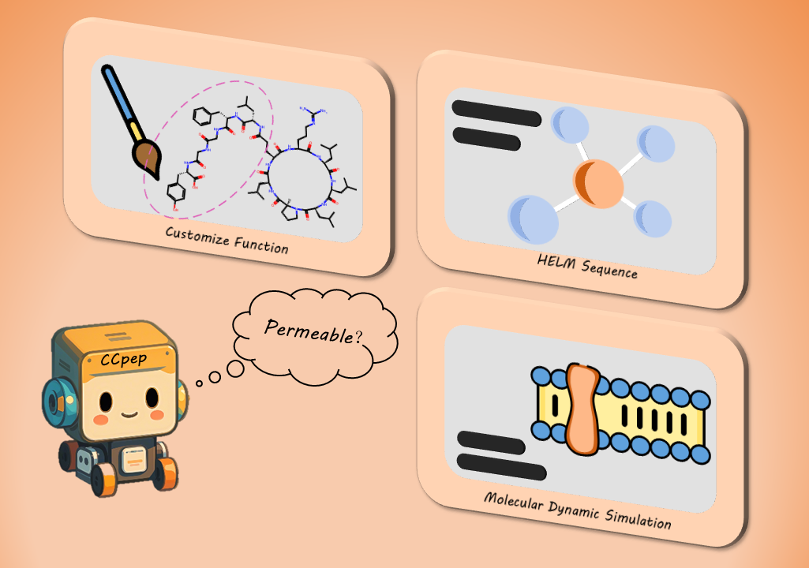

# AI-Driven De Novo design of customizable membrane permeable cyclic peptides




## Abstract
Cyclic peptides, prized for their remarkable bioactivity and stability, hold great promise across various fields. Yet, designing membrane-penetrating bioactive cyclic peptides via traditional methods is complex and resource-intensive. To address this, we introduce CCPep, an AI-driven de novo design framework that combines reinforcement and contrastive learning for efficient, customizable membrane-penetrating cyclic peptide design. It assesses peptide membrane penetration with scoring models and optimizes transmembrane ability through reinforcement learning. Customization of peptides with specific properties is achieved via custom functions, while contrastive learning incorporates molecular dynamics simulation time series to capture dynamic penetration features, enhancing model performance. Result shows that CCPep generated cyclic peptide sequences have a promising membrane penetration rate, with customizable chain length, natural amino acid ratio, and target segments. This framework offers an efficient tool for cyclic peptide drug design and paves the way for AI-driven multi-objective molecule design.


### Description of the document catalogue
eg:

```
filetree 
├── README.md
├── dataset
│  ├── amino_acid_vocab.json
│  ├── binding_vocab.json
├── extra model
│  ├── all_dataset.py
│  ├── contrastive_module.py
│  ├── contrastive_train.py
│  ├── helm_dataset.py
│  ├── helm_module.py
│  ├── time_dataset.py
│  ├── time_module.py
├── gmx_file
│  ├── conf.sh
│  ├── draw_gibbs_stage.sh
│  ├── gibbs.sh
│  ├── pca.sh
│  ├── pull.sh
│  ├── stage.sh
│  ├── SysEq.sh
├── gmx_utils
│  ├── gibbs_utils.py
│  ├── merge.py
│  ├── pca_utils.py
│  ├── xpm2png.py
├── HELM
│  ├── added_tokens.json
│  ├── config.json
│  ├── merges.txt
│  ├── special_tokens_map.json
│  ├── tokenizer_config.json
│  ├── voc.json
│  ├── vocab.json
├── main
│  ├── customize.py
│  ├── Dataset.py
│  ├── score_function.py
│  ├── Student_RNN.py
│  ├── Teacher_Bart.py
```

### Requirements
```
scikit-learn            1.3.0
pytorch                 2.2.1
pytorch-lightning       2.4.0
transformers            4.46.2
tokenizers              0.20.3
tqdm                    4.65.0
```

